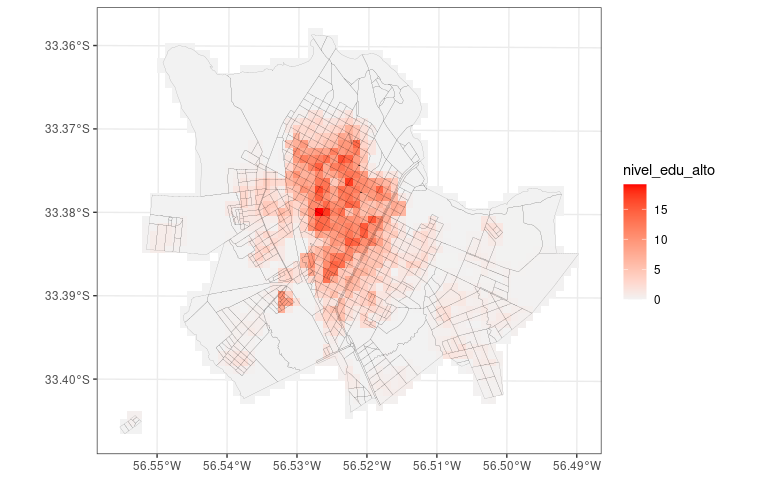
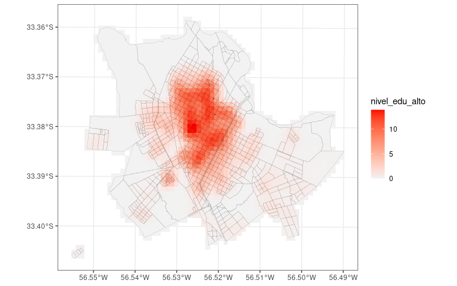
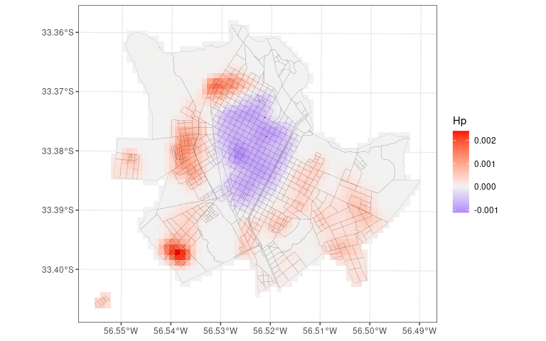

<!-- README.md is generated from README.Rmd. Please edit that file -->

# socialseg

## Installation

Install `socialseg` using the command
`devtools::install_github("https://github.com/emehache/socialseg)`.

## Usage

``` r
data(input)

vars <- c("nivel_edu_alto", "nivel_edu_bajo")

distribuido <- input %>% 
  distribute(lx = 100, vars = vars) 

plot(distribuido, var = vars[1])
```



``` r

suavizado <- smoothgrid(distribuido, sigma = 200)
plot(suavizado, var = vars[1])
```



``` r

entornos <- environments(suavizado, gamma = 500, vars = vars)
plot(entornos, var = "Hp")
```



``` r

coef(distribuido)
#>         H 
#> 0.2008533
coef(suavizado)
#>         H 
#> 0.1768627
coef(entornos)
#> [1] "Entornos construidos con gamma = 500"
#>        H 
#> 0.122412
```
